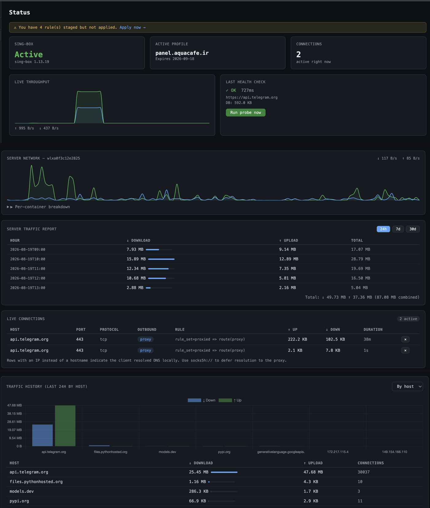

# sing-box Proxy Dashboard

A self-hosted web dashboard for managing [sing-box](https://github.com/SagerNet/sing-box) as a proxy/VPN gateway. Built with FastAPI and a clean dark UI, it gives you a single pane of glass for VPN subscriptions, live traffic, routing rules, and server monitoring — all running on your own server with no external dependencies.



---

## Features

### VPN & Subscription Management
- **Import subscriptions** from any URL (VLESS, VMess, Trojan, Hysteria2, TUIC, ShadowTLS, and more)
- **Server list** with latency display, protocol badges, and one-click selection
- **Auto / Manual mode** — pick a specific server or let sing-box auto-select the fastest
- **Staging validation** — test a new config on a temporary port before going live; rolls back on failure
- **Rules engine** — add/remove/toggle `domain_suffix`, `domain`, `ip_cidr`, and other rules that control what traffic routes through the proxy vs. goes direct

### Live Traffic Monitoring
- **Live connections** table — every active proxy connection with host, port, protocol, outbound node, rule matched, upload/download bytes, and duration
- **Close connection** button per row
- **Traffic history** — last 24 hours broken down by host, hour, or day with a bar chart
- **VPN status dot** in the nav bar — green / yellow / red based on current health

### Server Network Monitoring
- **Real-time server chart** — host-wide RX/TX rate polled from `/proc/net/dev`, auto-detects the main interface
- **Server traffic reports** — daily / weekly / monthly consumption table with totals
- **Per-container breakdown** — Docker container network stats (total RX/TX since start)

### Container Management
- **Docker container list** — all containers with status, image, network mode, and proxy env-var status
- **Quick-add rule** — pre-fills the Rules form from a container's name

### System
- **Health checks** — periodic HTTPS probes through the proxy with latency history and a chart
- **Audit log** — every dashboard action (subscription apply, rule change, server select) is logged
- **Session login** with Argon2id password hashing and rate-limited brute-force protection

### Optional: Hermes AI Agent Integration
- View and switch the active LLM model (built-in providers like Gemini + any OpenAI-compatible API)
- Add / test / remove custom providers
- Fetch the full model list from a provider and activate with one click

---

## Requirements

- Linux server (x86_64)
- [sing-box](https://sing-box.sagernet.org/installation/) — provides the actual proxy
- **Docker + Docker Compose** (recommended) — or Python 3.12+ for bare-metal install
- Outbound subscription URL (from your VPN provider)

---

## Quick Start (Docker)

### 1. Clone and configure

```bash
git clone https://github.com/alvandyhamed/singbox-proxy-dashboard.git
cd singbox-proxy-dashboard

cp .env.example .env
cp singbox/config.json.example singbox/config.json
```

### 2. Edit `.env`

```bash
# Generate a random secret key
python3 -c "import secrets; print(secrets.token_hex(32))"

# Generate a password hash
python3 -c "from argon2 import PasswordHasher; print(PasswordHasher().hash('yourpassword'))"
```

Set `DASHBOARD_SECRET_KEY`, `DASHBOARD_PASSWORD_HASH`, and `CLASH_API_SECRET` in `.env`.

### 3. Edit `singbox/config.json`

Make sure `experimental.clash_api.secret` matches `CLASH_API_SECRET` in `.env`.

### 4. Download Chart.js (one-time)

```bash
curl -fsSL https://cdn.jsdelivr.net/npm/chart.js@4.4.4/dist/chart.umd.min.js \
  -o app/static/chart.min.js
```

### 5. Start

```bash
docker compose up -d
```

Dashboard is available at `http://your-server:8787`.

---

## Usage: Adding Your First VPN Subscription

Once the dashboard is running, open it in your browser and log in. The core workflow is:

### 1. Import a subscription

Go to the **Subscriptions** tab. Paste your subscription URL (the link your VPN provider gives you — it usually starts with `https://` and returns a list of servers) and click **Add**.

The dashboard fetches the URL, parses all servers, and stores them locally. Supported protocols: VLESS, VMess, Trojan, Hysteria2, TUIC, ShadowTLS, Shadowsocks, and more.

### 2. Apply the subscription

Click **Apply (validate + swap)**. The dashboard will:
1. Generate a new sing-box config with all parsed servers
2. Start it on a temporary port and run a connectivity test
3. If the test passes, swap it in as the live config and restart sing-box
4. If the test fails, roll back automatically — your current connection is never broken

### 3. Pick a server (optional)

By default, sing-box uses **Auto** mode and selects the fastest server. To pick a specific one:
- Go to **Subscriptions → server list**
- Click a server row to activate it
- The latency badge updates in real time

### 4. Configure routing rules

Go to the **Rules** tab to control which traffic goes through the proxy and which goes direct.

Add a rule:

| Field | Example | Meaning |
|---|---|---|
| Type | `domain_suffix` | Match by domain ending |
| Value | `google.com` | All subdomains of google.com |

| Rule type | Matches |
|---|---|
| `domain_suffix` | `google.com` → matches `mail.google.com`, `www.google.com` |
| `domain` | exact hostname only |
| `domain_keyword` | any domain containing the keyword |
| `ip_cidr` | an IP range, e.g. `10.0.0.0/8` |

Rules are applied immediately after saving — no restart needed.

### 5. Verify connectivity

Check the **Status** page:
- **SING-BOX** card shows `Active` in green
- **Last Health Check** shows `OK` with a latency reading
- **Live Throughput** chart shows traffic moving

The status dot in the nav bar (green / yellow / red) gives you a quick health indicator at all times.

---

## Bare-Metal Install (systemd)

> Use this if you prefer running without Docker, e.g. on a router or SBC.

```bash
sudo bash install.sh
```

The script:
1. Creates a `dashboard` system user
2. Installs the app to `/opt/proxy-dashboard`
3. Creates a Python venv and installs dependencies
4. Downloads Chart.js
5. Copies `.env.example` and prompts you to edit it
6. Installs the systemd service (`proxy-dashboard.service`)
7. Prints an optional Caddy reverse-proxy snippet

```bash
# After editing /opt/proxy-dashboard/.env:
sudo systemctl start proxy-dashboard
sudo systemctl status proxy-dashboard
```

---

## Reverse Proxy (Caddy)

The dashboard binds to `127.0.0.1:8787` by default. To expose it publicly with TLS:

```
proxy.example.com {
    basic_auth {
        operator <hash from: caddy hash-password>
    }
    reverse_proxy 127.0.0.1:8787
}
```

Or access it securely without exposing any ports via SSH tunnel:

```bash
ssh -N -L 8787:127.0.0.1:8787 user@your-server
# Then open http://localhost:8787
```

---

## Configuration Reference

All configuration is via environment variables (`.env` file):

| Variable | Default | Description |
|---|---|---|
| `DASHBOARD_BIND` | `127.0.0.1:8787` | Listen address |
| `DASHBOARD_SECRET_KEY` | — | **Required.** Session signing key (32+ random bytes) |
| `DASHBOARD_PASSWORD_HASH` | — | **Required.** Argon2id hash of your login password |
| `CLASH_API_URL` | `http://127.0.0.1:9090` | sing-box Clash API address |
| `CLASH_API_SECRET` | — | **Required.** Must match `clash_api.secret` in sing-box config |
| `SINGBOX_CONFIG` | `/etc/sing-box/config.json` | Path to the sing-box config file |
| `SINGBOX_RULESET` | `/etc/sing-box/rules/proxied.json` | Path to the proxied rule-set file |
| `SINGBOX_BIN` | `/usr/local/bin/sing-box` | sing-box binary path |
| `SINGBOX_CONTAINER_NAME` | `singbox` | Docker container name (Docker mode only) |
| `PROXY_PORT` | `1080` | Main proxy inbound port |
| `STAGING_PORT` | `11080` | Temporary port for config validation |
| `STAGING_API_PORT` | `19090` | Clash API port for staging process |
| `HEALTH_TARGETS` | `https://api.telegram.org,...` | Comma-separated URLs for health probes |
| `DB_PATH` | `/opt/proxy-dashboard/data/dashboard.db` | SQLite database path |
| `HERMES_CONFIG_PATH` | *(unset)* | Optional path to Hermes `config.yaml`; enables the Hermes tab |

---

## Docker Container Proxy Setup

If you have containers that need to route through the proxy:

```yaml
# In your docker-compose.yml:
environment:
  - HTTP_PROXY=http://172.17.0.1:1080
  - HTTPS_PROXY=http://172.17.0.1:1080
  - http_proxy=http://172.17.0.1:1080
  - https_proxy=http://172.17.0.1:1080
```

`172.17.0.1` is the Docker bridge gateway — it reaches sing-box on the host. The dashboard's singbox config binds a second inbound on this address.

> **Note:** Use `http://` (HTTP CONNECT proxy) not `socks5://` — HTTP CONNECT sends the hostname to sing-box so domain-based routing rules work. `socks5://` resolves DNS locally and sends an IP, bypassing domain rules.

---

## sing-box config.json Notes

The included `singbox/config.json.example` sets up two inbounds:

| Tag | Address | Purpose |
|---|---|---|
| `local-in` | `127.0.0.1:1080` | Host processes, SSH tunnels |
| `docker-in` | `172.17.0.1:1080` | Docker bridge containers |

The dashboard re-generates this file when you apply a subscription. Your subscriptions, rules, and server selection are all managed through the UI — you only need to edit `config.json` manually for initial setup.

---

## Project Structure

```
singbox-proxy-dashboard/
├── app/
│   ├── main.py          # FastAPI app + lifespan
│   ├── collector.py     # Background traffic & net collectors
│   ├── singbox.py       # Config generation & sing-box management
│   ├── profiles.py      # Subscription parsing & server storage
│   ├── rules.py         # Routing rules management
│   ├── health.py        # Connectivity health checker
│   ├── clash.py         # Clash API client
│   ├── db.py            # SQLite schema + helpers
│   ├── auth.py          # Session auth + rate limiting
│   ├── config.py        # Settings from env
│   ├── routes/
│   │   ├── api.py       # REST + WebSocket endpoints
│   │   └── pages.py     # HTML page routes
│   ├── static/          # chart.min.js (downloaded at build time)
│   └── templates/       # Jinja2 HTML templates
├── singbox/
│   ├── config.json.example   # Template sing-box config
│   └── rules/
│       └── proxied.json      # Routing rule-set (managed by dashboard)
├── systemd/
│   └── proxy-dashboard.service
├── sudoers/
│   └── dashboard        # sudoers snippet for systemctl permission
├── Dockerfile
├── docker-compose.yml
├── requirements.txt
├── install.sh
└── .env.example
```

---

## Contributing

Pull requests are welcome. Some areas where contributions would be valuable:

- **Protocol support** — the subscription parser currently handles the most common formats; adding more exotic protocols is straightforward
- **Rule types** — currently `domain_suffix`, `domain`, `domain_keyword`, `ip_cidr`; adding process-name or port rules
- **Multi-user auth** — currently single-password; adding user accounts
- **Notifications** — webhook or Telegram alerts on health-check failures
- **Mobile UI** — the current CSS is desktop-first

To run locally:

```bash
python3 -m venv venv && source venv/bin/activate
pip install -r requirements.txt
curl -fsSL https://cdn.jsdelivr.net/npm/chart.js@4.4.4/dist/chart.umd.min.js -o app/static/chart.min.js
cp .env.example .env   # then edit .env
uvicorn app.main:app --reload
```

You will need a running sing-box instance with Clash API enabled for most features to work.

---

## License

MIT
